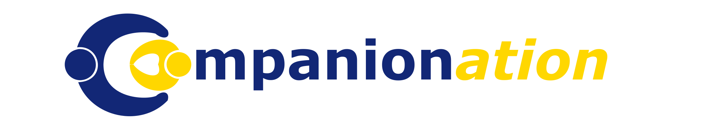
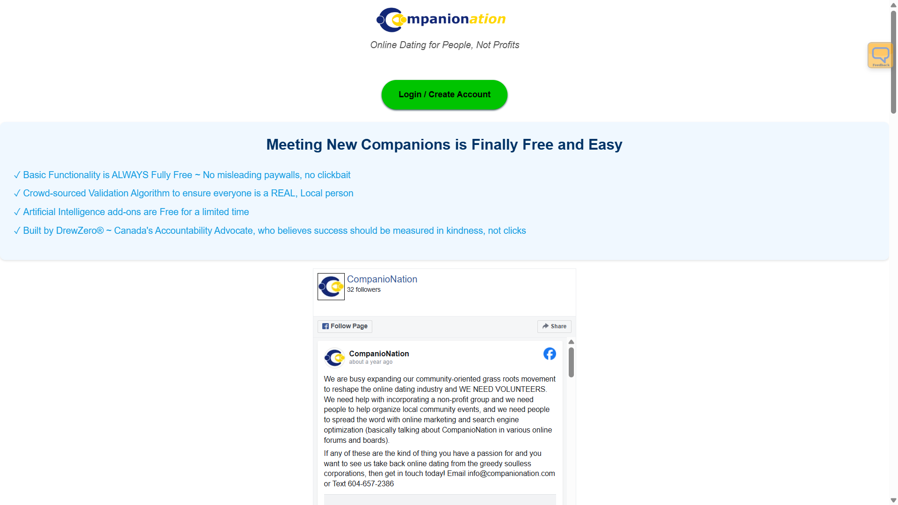
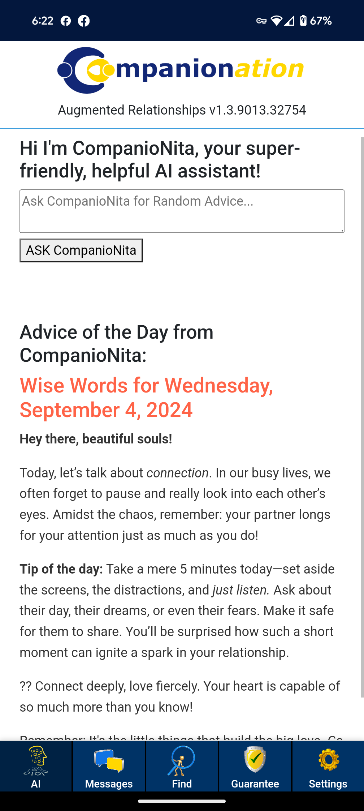
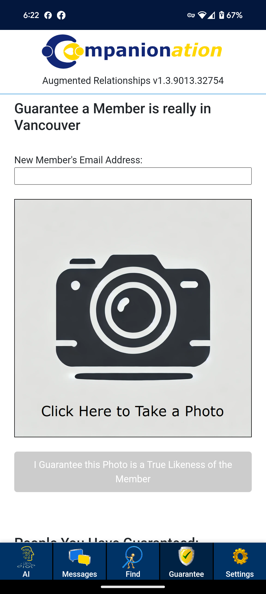
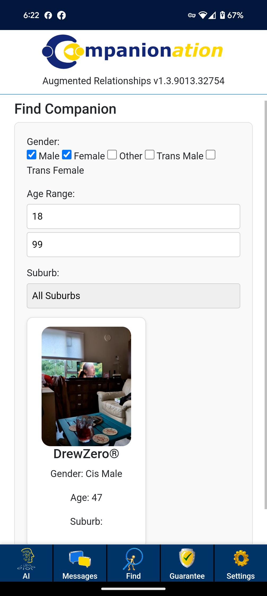
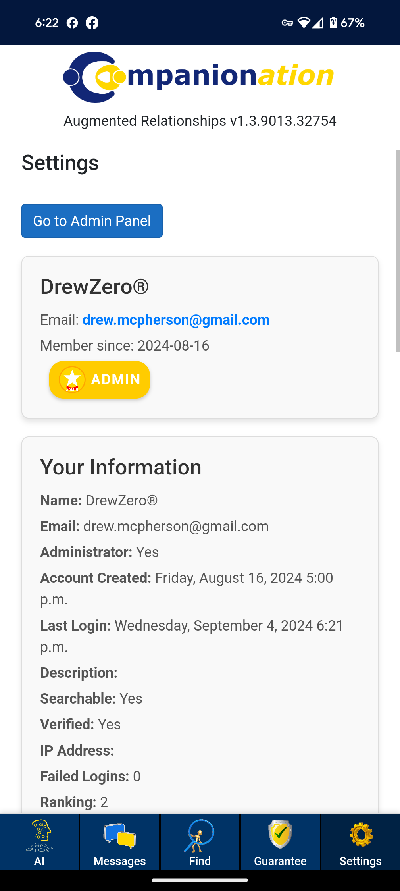
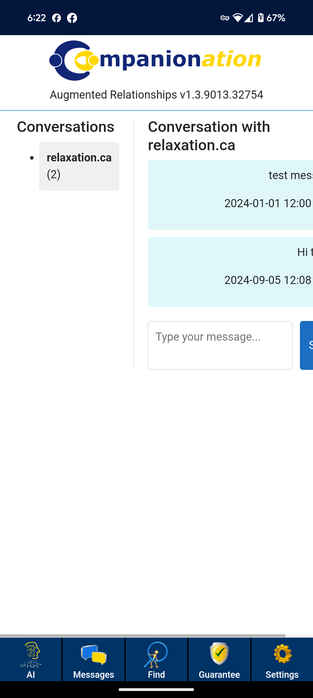
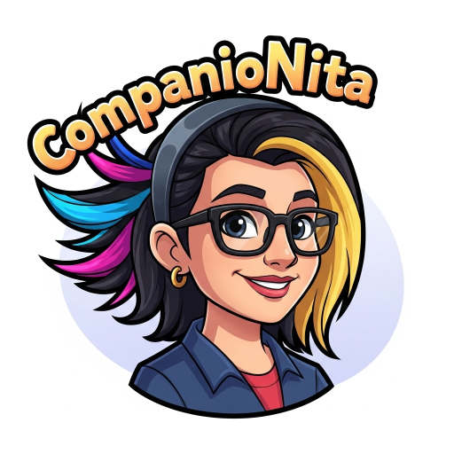

<p align="center">
  
</p>

<h1 align="center">CompanioNation™</h1>

<p align="center"><strong>Online Dating for People, Not Profits</strong></p>

<p align="center">
  The <strong>first ever open-source online dating app</strong> — no paywalls, no swipe games.<br />
  Just message the people you're interested in. Built for your success, not your clicks.
</p>

<p align="center">
  <a href="LICENSE-CNPL-1.0.txt"></a>
  
  
  
  
  
</p>

<p align="center">
  
  &nbsp;
  
  &nbsp;
  
</p>

<p align="center">
  
</p>

---

Copyright © 2026 Drew McPherson (DrewZero®)

CompanioNation™ is the **first ever open-source online dating app**, built to ensure transparency so that you know what is really happening behind the scenes. It is intended to encourage a **plural, competitive, and non-extractive dating ecosystem**.

There are no paywalls to access basic functionality. There are no swipe games. Just send messages to people you are interested in.

Forks, independent deployments, and alternative interpretations are **explicitly welcomed**.

This project is licensed under the **CompanioNation Public Licence (CNPL-1.0)**.

---

## About the Licence

CNPL-1.0 is a permissive, OSI-compatible open-source licence designed to:

- allow unrestricted use, modification, and redistribution
- permit commercial and hosted (SaaS) deployments
- protect contributors via an explicit patent grant
- preserve clear lineage and authorship without imposing control

See `LICENSE-CNPL-1.0.txt` for the full licence text.

---

## Why CompanioNation Exists

Curious about the motivation behind this project? Read the founder's story: **[Why CompanioNation Exists](WHY.md)**

---

## Project Goals

This repository exists to provide:

- transparency and auditability
- a practical, deployable reference implementation
- a durable foundation that cannot be paywalled, sabotaged, or captured
- an alternative to monopoly-driven dating infrastructure

CompanioNation™ exists to make sure that **at least one viable dating platform can always remain free**, without:

- artificial scarcity (likes, swipes, matches)
- engagement manipulation or dark patterns
- paywalls on basic human interaction
- algorithmic teasing designed to extract money rather than foster connection

It is about time that we, the people, took back control of the online dating infrastructure that shapes so much of our social lives.
CompanioNation™ measures success in human outcomes, not engagement metrics — built for people, not profit.

### How It Works

- **Just message people** — no swipe games, no artificial matching. See someone you are interested in? Send them a message.
- **LINK algorithm** — *Local Interaction Normalized Karma* keeps the platform free of bots and scammers so real people can connect safely.
- **CompanioNita** — an optional, paid AI-powered assistant that helps you understand and communicate better to achieve healthy success. This is the only paid component, and it is what keeps the site running.
- **Built for your success** — CompanioNation doesn't profit from clicks or churn. It profits from your success. No other dating app is built like this.

Future plans include partnering with local organizers to facilitate CompanioNation™ branded local offline events, meetups, and community-building activities.
If you or someone you know might be interested in organizing such events, please get in touch!

---

## 📱 Screenshots

A quick look at CompanioNation™ running as an installable Progressive Web App on desktop and mobile.

<p align="center">
  
</p>

<table align="center">
  <tr>
    <td></td>
    <td></td>
    <td></td>
  </tr>
  <tr>
    <td></td>
    <td></td>
    <td align="center" valign="middle">
      <br />
      <sub><strong>CompanioNita</strong><br />your optional AI companion</sub>
    </td>
  </tr>
</table>

---

# Developer Setup

Welcome to the CompanioNation™ project.

This guide helps you set up a **local development environment** using local services and emulators. No cloud resources are required for development.

---

## CI/CD

Ask Drew McPherson (drew.mcpherson@gmail.com) to run the CI/CD pipeline for you, and the current build will be pushed to the Azure staging server
located at: https://companionationpwa-alt.azurewebsites.net

---

## 🔧 Required Tools

- [.NET SDK 10 or later](https://dotnet.microsoft.com/download)
- [SQL Server Express LocalDB](https://learn.microsoft.com/en-us/sql/database-engine/configure-windows/sql-server-express-localdb)
- Visual Studio 2022+ (recommended)

---

## 🧪 Optional (Local Emulation)

- Azure Storage Emulator (Azurite)  
  Used only if you enable blob storage locally. Visual Studio can provision this automatically.

---

## ▶️ Run / Debug locally

1. Open the solution in Visual Studio.
2. Set the `CompanioNationAPI` project as the startup project.
3. Select the `https` launch profile for `CompanioNationAPI`.
4. Press F5 (Debug) or Ctrl+F5 (Run) — this starts the API and the Blazor WebAssembly front-end together.

> **⚠️ Always run `CompanioNationAPI`, never `CompanioNationPWA` directly.**
> `CompanioNationAPI` is the host: it serves the Blazor WebAssembly client **and** maps the SignalR
> hub (`/CompanioNationHub`) on `https://localhost:7114`. The `CompanioNationPWA` project on its own
> is just the static client — it has no API and no hub.
>
> Both projects launch on the same port (`7114`), so if you start `CompanioNationPWA` the site still
> loads, but SignalR fails with **`405 Method Not Allowed`** on `/CompanioNationHub/negotiate`. The
> startup project is a per-developer Visual Studio setting (stored in the git-ignored `.vs` folder),
> so it does **not** travel with the repo — every new clone must set it manually. As a safety net,
> running the client standalone in Development now shows a full-screen "Wrong startup project" notice
> instead of failing silently.

---

## 🔐 Login with Google

CompanioNation™ supports authentication via Google OAuth. 

**⚠️ Important:** OAuth can fail if browser developer tools debugging is enabled. If you encounter authentication failures during login:

1. Keep the Visual Studio debugger running
2. Open a **new browser instance** (without developer tools attached)
3. Navigate to `https://localhost:7114`
4. The login will work in the new instance

This occurs because OAuth validates the browser session, and active debugging can interfere with the validation process.

---

## ⚙️ Environment Variables

Copy the provided sample file and rename it:

```text
myapp.env.sample → .env
```

