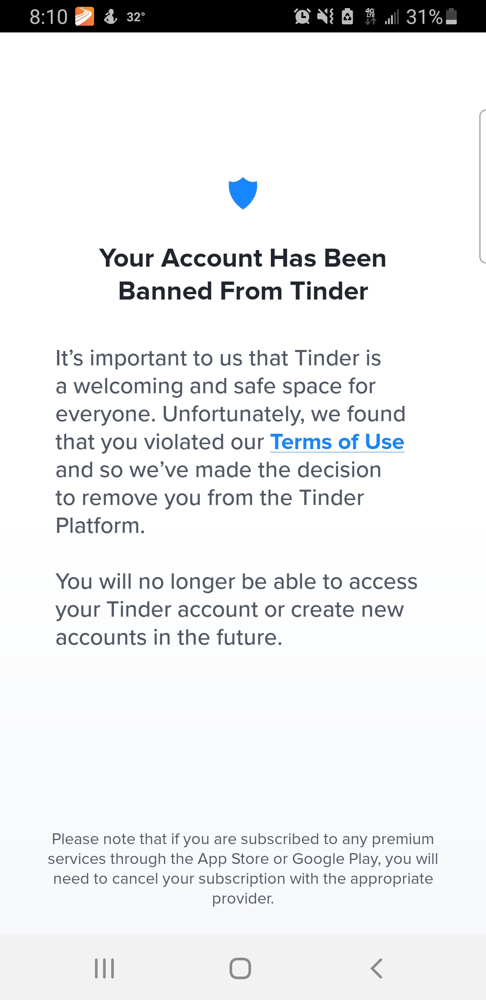

# Why CompanioNation Exists

*A personal note from the founder, Drew McPherson*

---

  

**Does this look familiar?**

If you've ever been banned from a dating app with no meaningful explanation, no appeal process, and no recourse — you're not alone. This is the experience that set CompanioNation in motion.

---

## The Ban With No Explanation

Tinder's ban notification is a masterclass in opacity: it tells you that you violated the Terms of Use, but never tells you *what you actually did*. There is no hearing, no evidence presented, and — as many users have reported — typically no way to appeal or even get a human response from support.

This lack of transparency and due process in dating app moderation has been [widely reported](https://mashable.com/article/tinder-banned-account). Users across Reddit, social media, and news outlets have documented identical experiences: sudden bans, form-letter responses, and zero accountability.

In my case, I'm a University of Waterloo–educated software engineer and a MENSA member. Those who know me well would probably describe me as caring, considerate, tolerant, kind, and giving. I'm also neurodivergent — which, as it turns out, may be more relevant to this story than it first appears.

---

## Neurodivergence and Online Dating

A growing body of research shows that neurodivergent individuals — including those on the autism spectrum and those with ADHD — face unique and significant challenges in dating and social connection. Difficulty reading social cues, navigating unwritten rules, and building social networks are [well-documented barriers](https://www.frontiersin.org/articles/10.3389/fpsyg.2021.751489/full).

Ironically, these are the very people who could benefit *most* from well-designed companionship platforms. A thoughtful, inclusive dating app could be genuinely life-changing for neurodivergent users — yet the dominant platforms are often the least accommodating.

---

## A Broader Pattern: Match Group Under Scrutiny

My experience didn't happen in a vacuum. Match Group — the company behind Tinder, Hinge, OkCupid, Match.com, PlentyOfFish, and dozens of other dating apps — has faced sustained criticism and regulatory action on multiple fronts:

### FTC Lawsuit Over Deceptive Practices (2024)

In September 2024, the U.S. Federal Trade Commission [sued Match Group](https://www.ftc.gov/news-events/news/press-releases/2024/09/ftc-takes-action-against-match-group-operator-tinder-other-dating-apps-deceiving-users-fabricating), alleging that the company used fake "like" notifications to lure users into purchasing paid subscriptions. According to the FTC's complaint, Match Group knowingly sent notifications about "likes" from accounts the company had already flagged as likely spam or fraudulent — essentially leveraging fabricated romantic interest to extract money from users.

### Registered Sex Offenders on Free Platforms (2019)

A joint investigation by [ProPublica and Columbia Journalism Investigations](https://www.propublica.org/article/tinder-lets-known-sex-offenders-use-the-app-its-not-the-only-one) found that Match Group did not screen for registered sex offenders on its free platforms, including Tinder, OkCupid, and PlentyOfFish. The investigation documented cases of users being matched with individuals who had prior sexual assault convictions. Background checks were reserved for the paid platform, Match.com.

### Reports of Sexual Assault and Safety Concerns

A major investigation by Australia's ABC *Four Corners* program, in collaboration with Hack and triple j, [documented numerous reports](https://www.abc.net.au/news/2021-04-01/tinder-sexual-assault-investigation-four-corners/100040688) of sexual assault by users who met their attackers through Tinder. The investigation raised serious questions about the platform's safety reporting mechanisms and its response to victim complaints.

### Market Dominance and Anti-Competitive Concerns

Match Group controls a significant share of the global online dating market, operating [over 45 brands](https://en.wikipedia.org/wiki/Match_Group) across multiple countries. This level of market concentration means that when a user is banned from one platform, they may effectively be excluded from a substantial portion of the available dating ecosystem — with no independent oversight, appeal, or explanation.

---

## How CompanioNation Was Born

After being banned without explanation and finding Tinder's support team unable — or unwilling — to provide any clarity, I attempted to create new accounts. Each time, I was detected and re-banned, still with no explanation of what rule I had allegedly broken.

As an experienced software engineer, I eventually realized something: **it was less work to build an entirely new dating platform from scratch than it was to navigate Match Group's opaque bureaucracy.**

So that's what I did.

CompanioNation is built on a fundamentally different set of principles:

- **Open source** — the code is public, auditable, and forkable
- **Free** — basic human connection should never be paywalled
- **Transparent** — no dark patterns, no engagement manipulation, no fake notifications
- **Inclusive** — designed with empathy for all users, including neurodivergent individuals
- **Community-driven** — success is measured in human outcomes, not engagement metrics

---

## An Invitation

CompanioNation exists today because one person's frustrating experience with a monopolistic platform turned into a mission to build something better.

If you've had a similar experience — banned without explanation, frustrated by paywalls on basic social interaction, exhausted by manipulative design — you're exactly who this project is for.

I hope that together, we can make online dating, and the world, a place that is a little bit better than it was.

---

*— Drew McPherson (DrewZero®), Founder of CompanioNation™*

---

### References

1. **FTC v. Match Group (2024)** — [FTC Takes Action Against Match Group](https://www.ftc.gov/news-events/news/press-releases/2024/09/ftc-takes-action-against-match-group-operator-tinder-other-dating-apps-deceiving-users-fabricating) — FTC alleged Match Group used fabricated notifications about fake "likes" to deceive consumers into purchasing subscriptions.

2. **ProPublica & CJI Investigation (2019)** — [Tinder Lets Known Sex Offenders Use the App. It's Not the Only One.](https://www.propublica.org/article/tinder-lets-known-sex-offenders-use-the-app-its-not-the-only-one) — Investigation found Match Group's free apps did not screen for registered sex offenders.

3. **ABC Australia Four Corners (2021)** — [Tinder sexual assault investigation](https://www.abc.net.au/news/2021-04-01/tinder-sexual-assault-investigation-four-corners/100040688) — Documented reports of sexual assault linked to matches made on Tinder.

4. **Match Group market position** — [Match Group - Wikipedia](https://en.wikipedia.org/wiki/Match_Group) — Overview of Match Group's portfolio of 45+ dating brands and market dominance.

5. **Neurodivergence and dating challenges** — [Frontiers in Psychology (2021)](https://www.frontiersin.org/articles/10.3389/fpsyg.2021.751489/full) — Research on the unique social and dating challenges faced by neurodivergent individuals.
